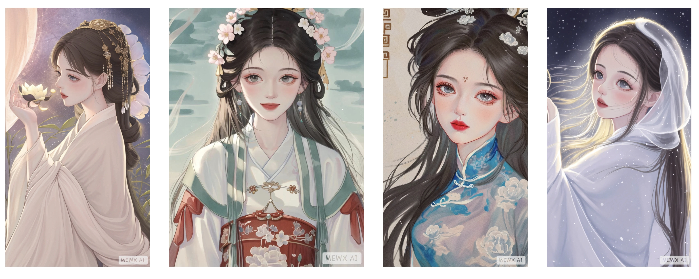
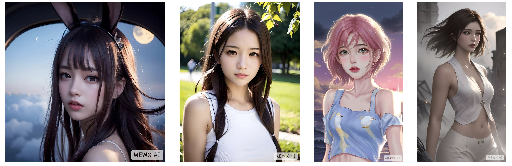
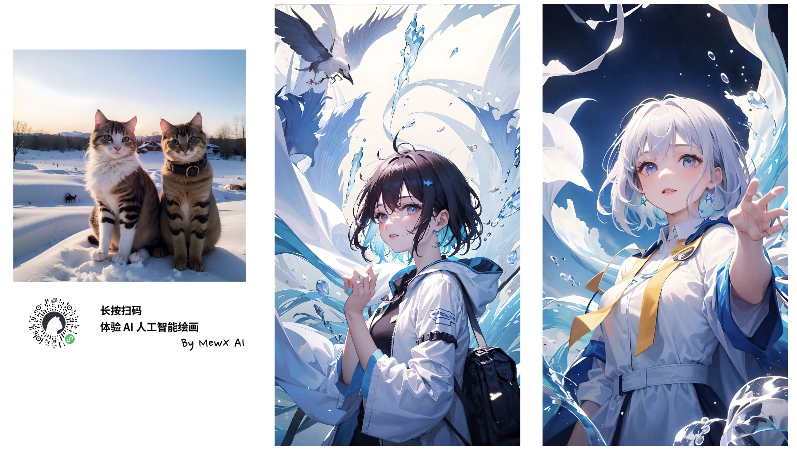

# AI Product Notes

## 2023-07-13 Update

Another round of optimization is live, including a cleaner eye-detail version of the QR style. The examples below can be scanned directly in WeChat.

Product: [MewXAI Star Moon Bear](https://qr.mewx.art)

 
 

 
 

 
 

## 2023-06-25 Update

After another week of iteration, I built a QR code generator: https://www.qrcode1s.com

The results below come from the base method in the linked tutorial, plus additional improvements and stronger MewXAI model blending.

 
 

### Recommended AI QR Code Tutorials

https://www.bilibili.com/video/BV1Jm4y1v76C

https://www.youtube.com/watch?v=HOY5J9UT_lY

## 2022-12-10 Update

This section had been quiet for a while because I also spent time investing in AI art projects. Resource updates will continue.

**MewXAI mini-program**

Online: https://www.mewxai.cn

The product includes a Chinese-style model that was presented here as unique within the market at the time, along with more advanced features such as ControlNet support and LoRA blending.

It also includes realistic, heavy-paint, 2.5D, and anime-style models.

Scan the code below to claim **30 free credits** and try it immediately:

#### Ongoing updates

Many platforms now offer AI art capabilities. This repository keeps collecting the more interesting ones, and pull requests are welcome.
