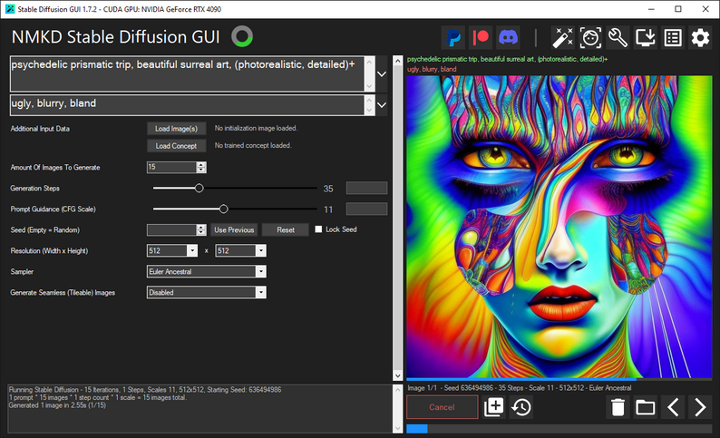
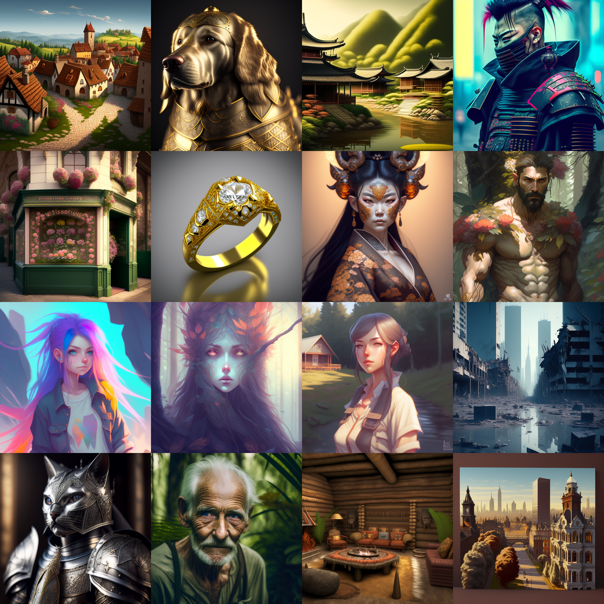
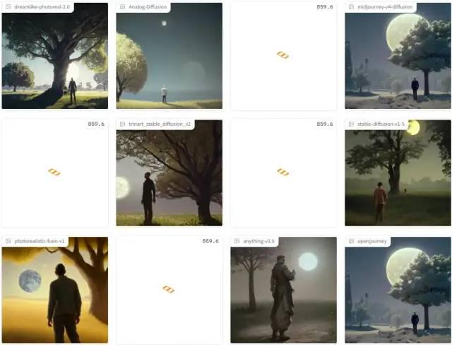
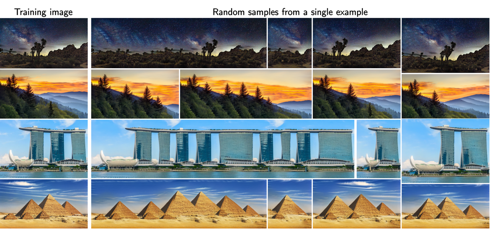
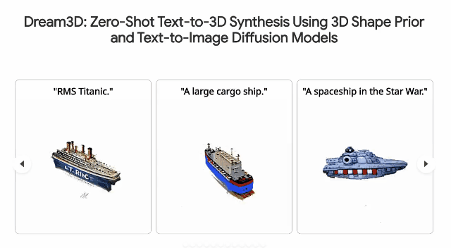
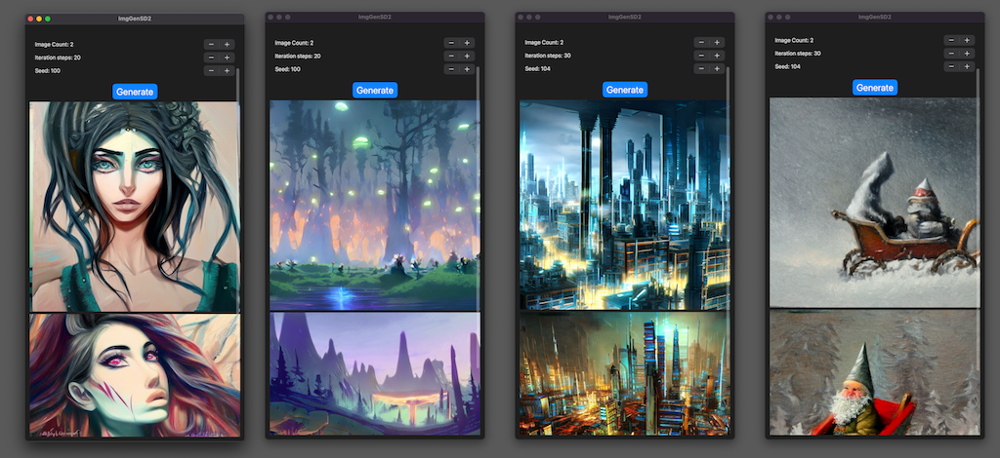
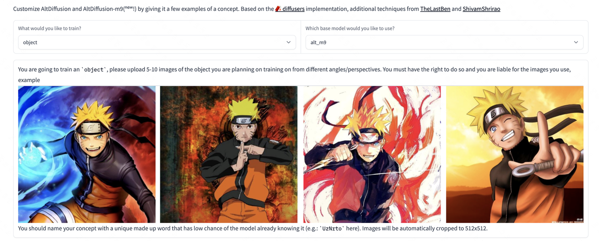
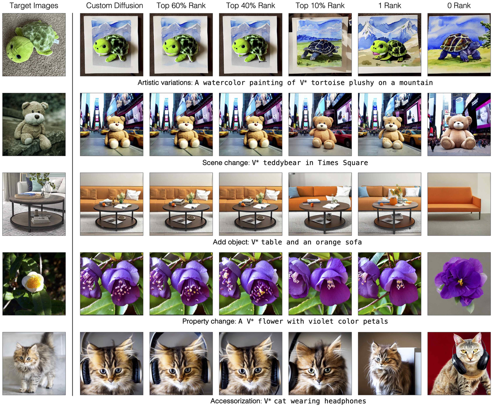
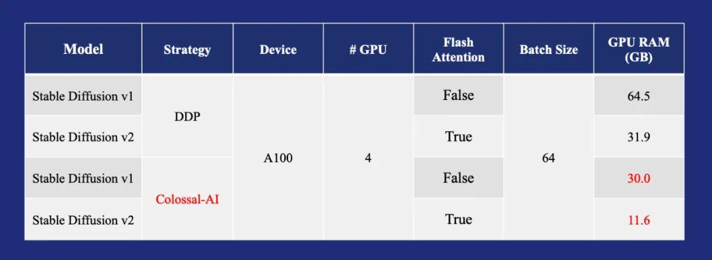
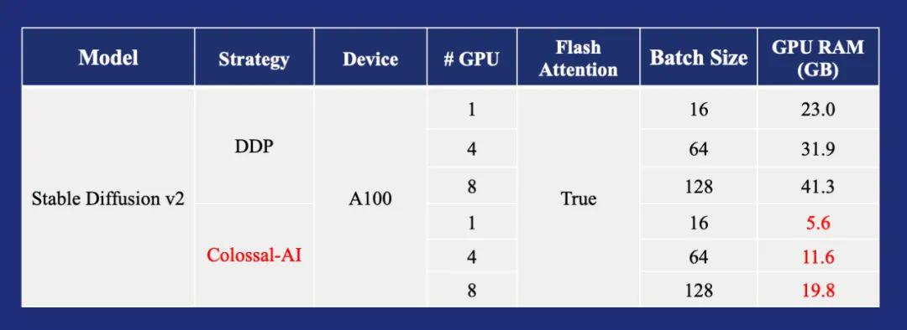

# News Roundup: January 1 to January 7, 2023

### Windows GUI Tool

https://nmkd.itch.io/t2i-gui

### Very Clean Anime Generation Model

https://huggingface.co/aipicasso/cool-japan-diffusion-2-1-0-beta

### New High-Quality Model

https://huggingface.co/22h/vintedois-diffusion-v0-1

### Maximum Diffusion

Runs 12 models side by side for comparison.

https://huggingface.co/spaces/Omnibus/maximum_diffusion

### Train from a Single Image

SinDDM can train a generative model from a single natural image and then sample new outputs from that source image.

https://github.com/fallenshock/SinDDM

### Tencent-Led Text-to-3D Project

No code was available at the time this note was added.

https://bluestyle97.github.io/dream3d/

### iOS App That Runs Stable Diffusion 2.0 Directly

https://github.com/ynagatomo/ImgGenSD2

### Multilingual Image-to-Text Model with Support for Nine Languages

https://huggingface.co/spaces/BAAI/dreambooth-altdiffusion

### New Training Method: Custom Diffusion

Similar in spirit to DreamBooth.

https://github.com/adobe-research/custom-diffusion

### Fragment-Style Model

https://huggingface.co/Stkzzzz222/fragments_V2

### Colossal-AI Framework for Lower Training Costs

https://mp.weixin.qq.com/s/IdK0XLitqfu0iPGqHnNQzw

