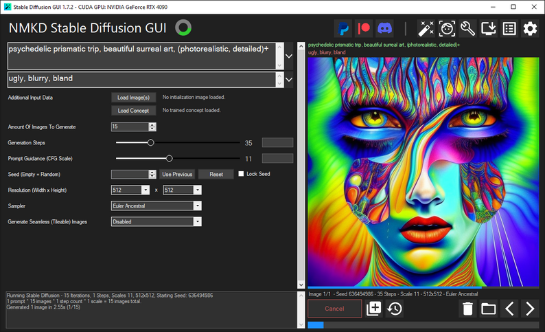
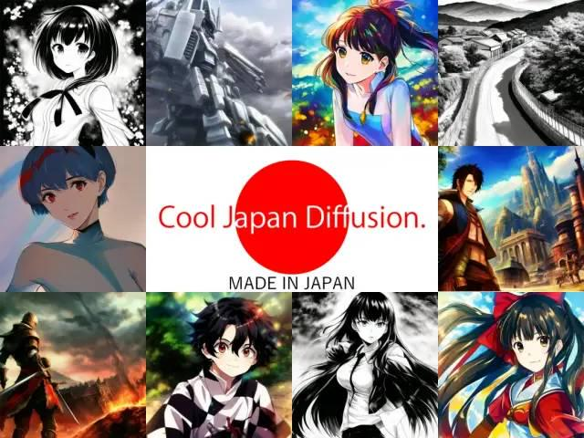
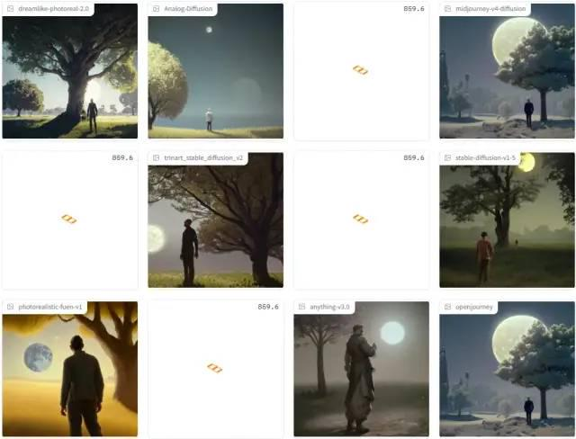
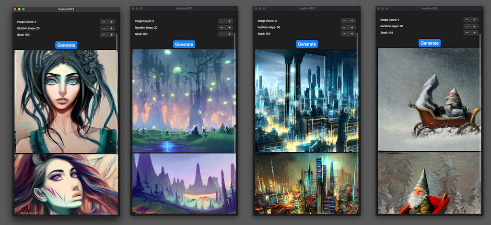
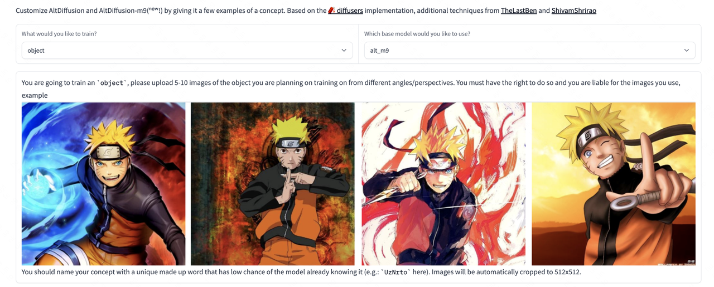

### Windows GUI 工具
https://nmkd.itch.io/t2i-gui

### 绝对纯净的二次元生成模型
https://huggingface.co/aipicasso/cool-japan-diffusion-2-1-0-beta

### 新的高质量模型
https://huggingface.co/22h/vintedois-diffusion-v0-1

### Maximum Diffusion
同时运行12个模型，进行对比

https://huggingface.co/spaces/Omnibus/maximum_diffusion

### 一张图进行训练
使用 SinDDM，可以从单个自然图像训练生成模型，然后从给定的图像生成随机样本

https://github.com/fallenshock/SinDDM

### 腾讯领衔 TextTo3D
目前还没有代码

https://bluestyle97.github.io/dream3d/

### iOS APP 直接跑 Stable Diffusion 2.0
https://github.com/ynagatomo/ImgGenSD2

### 支持9种语言的多语言图像到文本模型
https://huggingface.co/spaces/BAAI/dreambooth-altdiffusion

### 新的训练方式 custom-diffusion
类似 dreambooth

https://github.com/adobe-research/custom-diffusion

### 碎片感的模型
https://huggingface.co/Stkzzzz222/fragments_V2

### 降低训练成本框架 Colossal-AI
https://mp.weixin.qq.com/s/IdK0XLitqfu0iPGqHnNQzw

